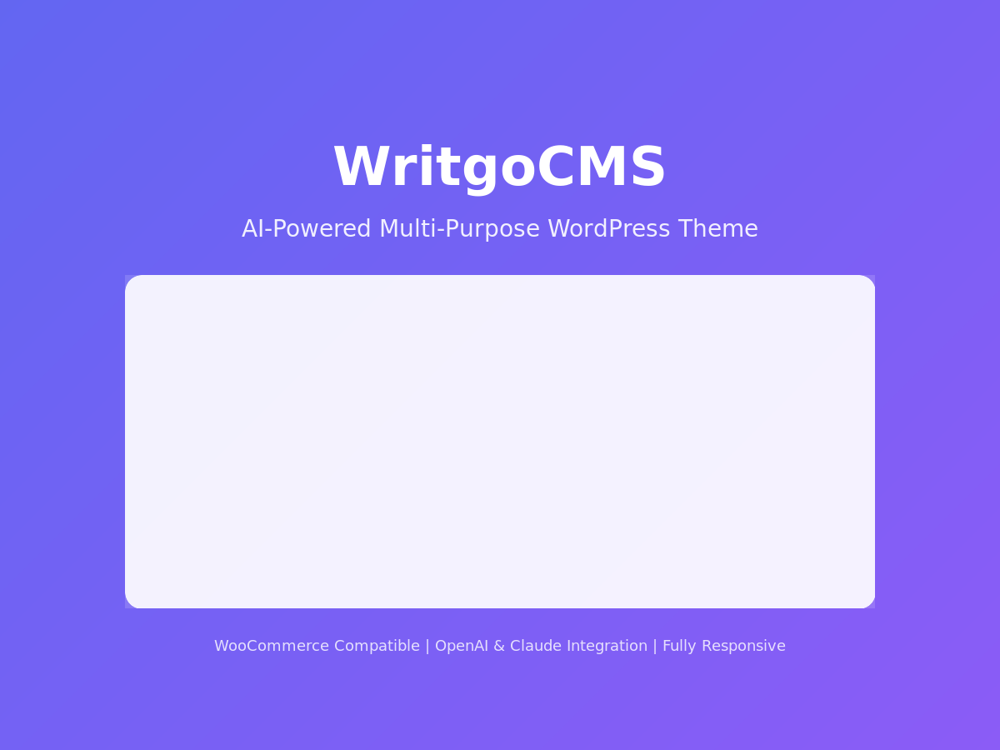

# WritgoCMS

AI-Powered Multi-Purpose WordPress Theme with AIML Multi-Provider Integration.



## 🚀 Features

### AI Integration
- **Text Generation**: OpenAI (GPT-4, GPT-3.5), Anthropic Claude, Google Gemini, Mistral AI
- **Image Generation**: DALL-E, Stability AI, Leonardo.ai, Replicate
- **Gutenberg Block Support**: AI-powered content generation directly in the editor
- **Classic Editor Integration**: AI button for traditional editing experience

### Theme Features
- **4 Professional Templates**: Shop, Blog, Business, Affiliate
- **Fully Responsive Design**: Mobile-first approach with breakpoints for all devices
- **Modern CSS Variables**: Easy customization of colors, fonts, and spacing
- **Widget Areas**: Sidebar, 3 Footer columns, Hero section
- **Navigation Menus**: Primary, Footer, and Social Links menus
- **Block Editor Support**: Full support for Gutenberg with custom styles
- **WooCommerce Compatible**: Ready for e-commerce integration

## 📋 Installation

### Method 1: Direct Upload
1. Download the theme as a ZIP file
2. Go to WordPress Admin → Appearance → Themes
3. Click "Add New" → "Upload Theme"
4. Choose the ZIP file and click "Install Now"
5. Activate the theme

### Method 2: FTP Upload
1. Extract the theme ZIP file
2. Upload the `WritgoCMS` folder to `/wp-content/themes/`
3. Go to WordPress Admin → Appearance → Themes
4. Find WritgoCMS and click "Activate"

### Method 3: Git Clone
```bash
cd /path/to/wordpress/wp-content/themes/
git clone https://github.com/Mikeyy1405/WritgoCMS.git
```

## ⚙️ Configuration

### Setting Up AI Features
1. Go to WordPress Admin → Settings → WritgoCMS AIML
2. Enter your API keys for the providers you want to use:
   - OpenAI API Key
   - Anthropic Claude API Key
   - Google Gemini API Key
   - Mistral API Key
   - Stability AI API Key
   - Leonardo.ai API Key
   - Replicate API Key
3. Select your preferred default text and image providers
4. Save settings

### Setting Up Menus
1. Go to Appearance → Menus
2. Create menus for:
   - **Primary Menu**: Main navigation in header
   - **Footer Menu**: Links in footer
   - **Social Links Menu**: Social media icons in footer

### Setting Up Widget Areas
Go to Appearance → Widgets to configure:
- **Sidebar**: Main sidebar widgets
- **Footer 1, 2, 3**: Three-column footer widget areas
- **Hero Section**: Homepage hero section widgets

## 🎨 Customization

### CSS Variables
The theme uses CSS custom properties for easy customization. Edit `style.css` to modify:

```css
:root {
    /* Colors */
    --color-primary: #6366f1;
    --color-primary-dark: #4f46e5;
    --color-secondary: #8b5cf6;
    --color-accent: #06b6d4;
    
    /* Typography */
    --font-primary: -apple-system, BlinkMacSystemFont, 'Segoe UI', Roboto, sans-serif;
    --font-size-base: 1rem;
    
    /* Spacing */
    --container-max-width: 1200px;
    --spacing-md: 1rem;
    
    /* Border Radius */
    --radius-md: 0.5rem;
}
```

### theme.json
The `theme.json` file provides block editor configuration:
- Color palette for blocks
- Typography settings
- Spacing presets
- Layout widths

## 📁 Template Files

| File | Description |
|------|-------------|
| `header.php` | Site header with logo and navigation |
| `footer.php` | Site footer with widgets and copyright |
| `index.php` | Main template for blog archives |
| `front-page.php` | Homepage template with hero and features |
| `page.php` | Single page template |
| `single.php` | Single post template |
| `sidebar.php` | Sidebar widget area |
| `functions.php` | Theme setup and functionality |

## 🔌 JavaScript Features

The theme includes `assets/js/theme.js` with:
- **Mobile Navigation Toggle**: Responsive hamburger menu
- **Smooth Scrolling**: Smooth scroll to anchor links
- **Lazy Loading**: Image lazy loading for performance
- **Sticky Header**: Header behavior on scroll
- **Back to Top Button**: Scroll-to-top functionality
- **Form Validation**: Enhanced form validation
- **Keyboard Navigation**: Improved accessibility

## 📱 Responsive Breakpoints

```css
/* Mobile First */
/* Default styles for mobile */

/* Tablet */
@media (min-width: 768px) { }

/* Desktop */
@media (min-width: 1024px) { }

/* Large Desktop */
@media (min-width: 1200px) { }
```

## 🌐 Browser Support

- Chrome (latest)
- Firefox (latest)
- Safari (latest)
- Edge (latest)
- Opera (latest)

## 📄 Requirements

- WordPress 5.9 or higher
- PHP 7.4 or higher
- MySQL 5.7 or MariaDB 10.3

## 🔒 Security

- All user inputs are sanitized and escaped
- Nonce verification for AJAX requests
- Rate limiting for AI API calls
- Secure API key storage

## 📝 Changelog

### Version 1.0.0
- Initial release
- AI integration with 4 text providers and 4 image providers
- Responsive design with CSS variables
- Block editor support
- Widget areas and menu locations
- JavaScript functionality for interactivity

## 🤝 Contributing

1. Fork the repository
2. Create your feature branch (`git checkout -b feature/amazing-feature`)
3. Commit your changes (`git commit -m 'Add some amazing feature'`)
4. Push to the branch (`git push origin feature/amazing-feature`)
5. Open a Pull Request

## 📜 License

This theme is licensed under the GNU General Public License v2 or later.
See [LICENSE](http://www.gnu.org/licenses/gpl-2.0.html) for more information.

## 👨‍💻 Author

**Mikeyy1405**
- GitHub: [@Mikeyy1405](https://github.com/Mikeyy1405)

## 🙏 Credits

- Icons: [Lucide Icons](https://lucide.dev/)
- Fonts: System font stack

---

Made with ❤️ for the WordPress community